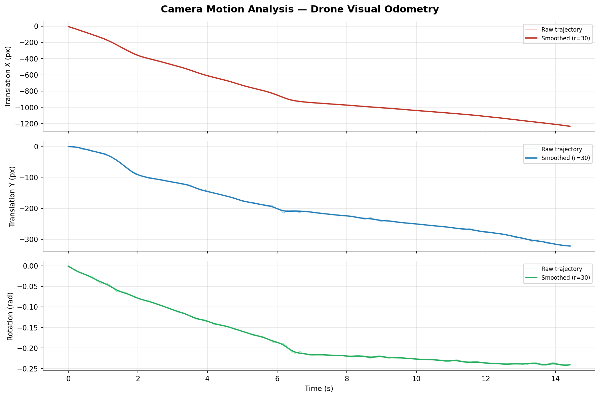

# Drone Visual Stabilization — Camera Motion Estimator

A Python/OpenCV implementation of drone video stabilization using **Lucas-Kanade sparse optical flow**, with two trajectory smoothing approaches compared side by side:
- **Butterworth low-pass filter** — frequency-domain filtering
- **Kalman filter** — the standard approach in embedded drone navigation (IMU/GPS fusion, PX4, ArduPilot)

Directly inspired by visual odometry principles used in drones like the Parrot Anafi UKR for GPS-denied navigation.

---

## Demo

### Butterworth vs Kalman — side-by-side comparison


### Motion trajectory analysis — raw vs smoothed



---

## How it works

**Pass 1 — Trajectory estimation**
- Detect sparse feature points with **Shi-Tomasi corner detection**
- Track them across frames with **Lucas-Kanade optical flow** (KLT)
- Estimate rigid motion (dx, dy, dθ) via `estimateAffinePartial2D`
- Accumulate per-frame motions into a cumulative **camera trajectory**

**Pass 2 — Stabilization**
- Smooth the raw trajectory (Butterworth or Kalman)
- Compute per-frame corrections = smoothed − raw
- Warp each frame with `warpAffine`
- Output side-by-side video: original (with flow overlay) vs stabilized

---

## Installation

```bash
git clone https://github.com/MagnetarTensor/drone-visual-stabilization.git
cd drone-visual-stabilization
pip install -r requirements.txt
```

---

## Usage

All scripts are in `src/`. Run them from the **project root**.

### 1. Add realistic shake to a smooth video

```bash
python src/add_shake.py drone.mp4 -o drone_shaky.mp4
python src/add_shake.py drone.mp4 -o drone_shaky.mp4 --intensity 1.5
```

### 2. Stabilize — Butterworth filter

```bash
python src/stabilizer_butterworth.py drone_shaky.mp4
python src/stabilizer_butterworth.py drone_shaky.mp4 --cutoff 1.0 --show
```

Output: `drone_shaky_stabilized.mp4`

| Argument | Default | Description |
|---|---|---|
| `--cutoff` | `1.5` | Low-pass cutoff in Hz. Lower = more aggressive smoothing. |
| `--show` | `False` | Display video while processing |

### 3. Stabilize — Kalman filter

```bash
python src/stabilizer_kalman.py drone_shaky.mp4
python src/stabilizer_kalman.py drone_shaky.mp4 --measurement-noise 0.1 --show
```

Output: `drone_shaky_kalman.mp4`

| Argument | Default | Description |
|---|---|---|
| `--process-noise` | `1e-4` | Kalman Q — higher = less smoothing |
| `--measurement-noise` | `5e-2` | Kalman R — higher = more smoothing |

### 4. Compare both approaches side by side

```bash
python src/compare.py drone_shaky.mp4 --show
```

Output: `assets/compare.mp4` — 3-column video with real-time stability metrics.

| Column | Approach | Color |
|---|---|---|
| Left | Original (shaky) | White |
| Center | Butterworth | Cyan |
| Right | Kalman | Green |

### 5. Analyze camera motion

```bash
python src/analyze_motion.py drone_shaky.mp4
```

Output: `assets/drone_shaky_motion_analysis.png` — raw vs smoothed trajectory plots (tx, ty, rotation).

---

## Project structure

```
drone-visual-stabilization/
├── src/
│   ├── stabilizer_butterworth.py  # Butterworth low-pass filter
│   ├── stabilizer_kalman.py       # Kalman filter
│   ├── compare.py                 # Side-by-side comparison + metrics
│   ├── add_shake.py               # Realistic periodic shake generator
│   └── analyze_motion.py          # Trajectory visualization
├── assets/
│   ├── compare.gif                # Main demo
│   ├── demo.gif                   # Butterworth demo
│   ├── demo_kalman.gif            # Kalman demo
│   └── drone_shaky_motion_analysis.png
├── requirements.txt
└── README.md
```

---

## Technical notes

- **Lucas-Kanade (KLT)** is lightweight and interpretable — well suited for embedded hardware (Jetson Nano/Xavier)
- **Butterworth filter** operates in the frequency domain — cuts all motion above `cutoff_hz` regardless of amplitude
- **Kalman filter** models trajectory as a dynamic system `[position, velocity]` — same approach used in IMU/GPS fusion in flight controllers. Forward+backward pass (RTS-style) for zero phase lag.
- The rigid affine model captures translation + rotation — appropriate for drone footage at quasi-constant altitude
- For production-grade visual odometry: extend with RANSAC outlier rejection, IMU fusion, or deep optical flow (RAFT, FlowNet2)

---

## Author

Benjamin Madar — [LinkedIn](https://www.linkedin.com/in/benjamin-madar) | [GitHub](https://github.com/MagnetarTensor)
